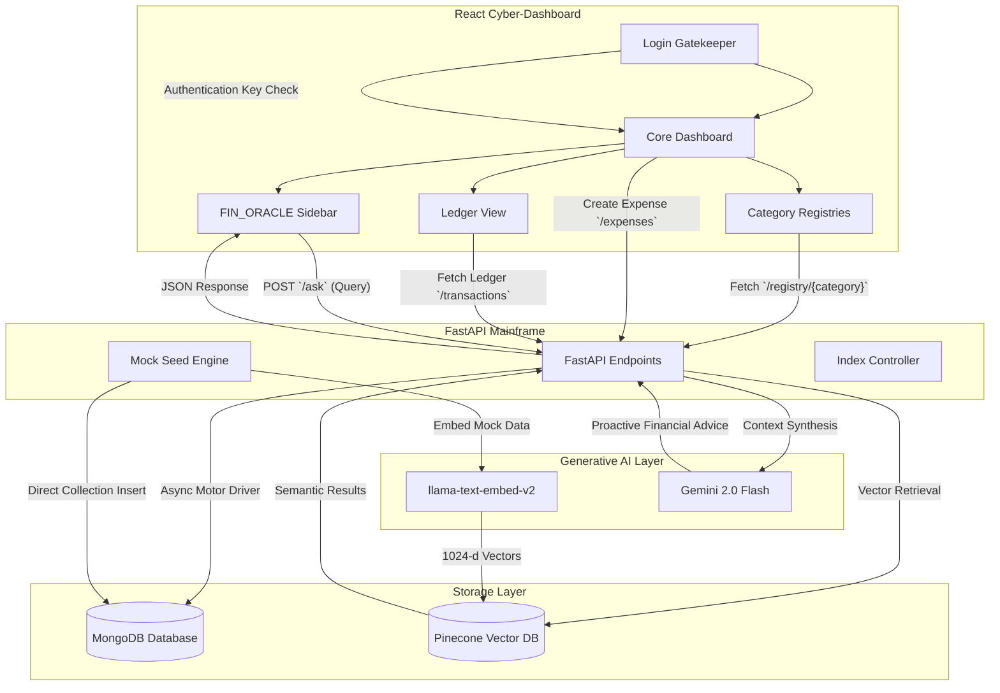

# 🌌 FinTech AI Advisor: FinOracle OS v2.4.1

Welcome to **FinOracle OS**, a next-generation, high-performance proactive financial advisory application. Built with an immersive **cyberpunk hacking-terminal/neon aesthetic**, FinOracle OS transitions personal finance tracking from a flat ledger of transactions into a highly structured, category-aware, AI-augmented advisor.

This repository implements a robust **RAG (Retrieval-Augmented Generation) pipeline** using FastAPI, MongoDB, Pinecone Vector Database, and Gemini 2.0 Flash to deliver data-grounded insights, proactive spending anomaly alerts, and actionable financial planning tailored for Indian consumers.

---

## 📋 Table of Contents
1. [Introduction](#-introduction)
2. [Problem Statement](#-problem-statement)
3. [Key Features](#-key-features)
4. [System Architecture](#-system-architecture)
5. [Database Design & Data Schemas](#-database-design--data-schemas)
    - [Users Collection](#1-users-collection)
    - [Expenses Collection (Structured)](#2-expenses-collection-structured)
    - [Category-Specific Metadata Schemas](#3-category-specific-metadata-schemas)
    - [Legacy Transactions Collection](#4-legacy-transactions-collection)
6. [Database Indexing Strategy](#-database-indexing-strategy)
7. [Vector RAG & AI Oracle Mechanics](#-vector-rag--ai-oracle-mechanics)
8. [Setup & Installation Guide](#-setup--installation-guide)

---

## 🚀 Introduction

**FinOracle OS** is a pair of highly integrated services:
*   **Vite-React Cyber-Dashboard**: A frontend themed around HSL neon styling, ambient canvas simplex noise animations, glassmorphism card panels, and retro CRT terminal scanline shaders.
*   **FastAPI Mainframe Server**: An asynchronous backend handling transactional operations, category aggregations, budget adjustments, and vector search query mappings.

By combining the speed of MongoDB (via the asynchronous Motor driver) with semantic similarity queries on a serverless Pinecone index, FinOracle OS empowers users with an intelligent chat interface (**FIN_ORACLE**) that knows their exact spending patterns and calls out anomalies (like sudden subscription renewals or infrastructure cost spikes) before they drain their accounts.

---

## 🎯 Problem Statement

Traditional expense trackers suffer from three critical flaws:
1.  **Flat, Unstructured Schema**: They treat a coffee purchase, a rent payment, and an AWS cloud bill as equivalent "minus amounts" in a flat log. This throws away vital category-specific metrics (e.g., landlord name for rent, trip distance for transit, renewal cycle for subscriptions).
2.  **No Proactive Intelligence**: They require users to manually study charts, look for line items, and perform mental calculations to find anomalous spikes.
3.  **Disconnected AI Assistants**: Most modern AI advisors are generic chat boxes. They lack real-time access to the user's secure historical transaction ledger, resulting in generic financial definitions rather than hyper-personalized, context-grounded warnings.

**FinOracle OS solves this by:**
*   Implementing **sub-schemas for category-specific metadata** (such as payment modes for Rent, daily travel logs for Transport, platform details for Food).
*   Executing an automated **mirroring pipeline** that transforms transactional logs into semantic vector embeddings.
*   Utilizing **Retrieval-Augmented Generation (RAG)** to feed local historical context to Google Gemini, making it a highly accurate, hallucination-free advisor.

---

## 🛠 Key Features

*   **🔒 Secure Terminal Gatekeeper**: A simulated startup diagnostic terminal that runs system checks (Encrypting uplink, Verifying Neural Net Integrity) and requires access key authorization (`admin`).
*   **📊 Core Matrix Dashboard**: Real-time aggregation cards with progress rings showing budget consumption, high-velocity spending analysis charts (powered by Recharts), and quick-entry transaction executors.
*   **🗄 Specialized Category Registries**: Dynamic custom itemized logs for different expenses:
    *   *Rent*: Month-by-month rental tracker displaying landlord details, billing month, and transaction reference numbers (UPI/NEFT).
    *   *Transport*: Trip breakdown mapping origin and destination, carrier provider, and distance traveled.
    *   *Subscription*: SaaS/Streaming management tracking billing frequencies (Monthly/Yearly), renewal indicators, and cancellation states.
    *   *Food, Entertainment, & Shopping*: Multi-filter logs segmented by platforms (Swiggy, Zomato, BookMyShow, Myntra) and delivery status.
*   **🔮 Conversational RAG Oracle Sidebar**: An active conversational terminal that provides real-time neural net processing feedback, extracts semantic references, flags large-value transaction anomalies, and advises on next steps.
*   **🌱 Realistic Indian Finance Seed Engine**: Generates highly authentic Indian mock transactions mapping to local brands (Zepto, Swiggy, Uber, PVR, Decathlon) with authentic platform metadata.

---

## 🏗 System Architecture

The following diagram illustrates how data flows between the user interface, backend endpoints, relational datastores, vector indices, and the Generative AI model:



---

## 🗃 Database Design & Data Schemas

FinOracle OS utilizes **MongoDB** for transactional integrity, structured storage, and high-volume indexing, accompanied by **Pinecone** for real-time vector embeddings.

### 1. Users Collection
Stores user profiles, access settings, and custom category budget configurations.

```json
{
  "_id": "ObjectId",
  "email": "user@example.com",
  "name": "System Administrator",
  "budgets": {
    "food": 15000.0,
    "transport": 5000.0,
    "rent": 30000.0,
    "subscription": 2000.0,
    "entertainment": 5000.0,
    "shopping": 10000.0
  },
  "settings": {
    "currency": "INR",
    "theme": "dark",
    "notifications": true
  },
  "createdAt": "ISODate",
  "updatedAt": "ISODate"
}
```

### 2. Expenses Collection (Structured)
The main collection hosting all transactional expenditures, utilizing a flexible nested `meta` document that adapts dynamically based on the parent category.

```json
{
  "_id": "ObjectId",
  "category": "Food | Rent | Transport | Subscription | Entertainment | Shopping",
  "subCategory": "String",
  "amount": 25000.0,
  "currency": "INR",
  "description": "String",
  "merchant": "String",
  "date": "YYYY-MM-DD",
  "status": "completed | pending | failed",
  "meta": {},
  "createdAt": "ISODate",
  "updatedAt": "ISODate"
}
```

### 3. Category-Specific Metadata Schemas
When expenses are logged, the backend validates and populates custom sub-fields within the nested `meta` schema:

#### 🏠 Rent Meta
```json
{
  "modeOfPayment": "UPI | Bank Transfer | Cash",
  "upiRef": "UPI1234567890 (Nullable)",
  "bankRef": "NEFT123456 (Nullable)",
  "billingMonth": "YYYY-MM",
  "landlordName": "String",
  "propertyAddress": "String"
}
```

#### 🚗 Transport Meta
```json
{
  "transportType": "Ride | Transit | Fuel",
  "provider": "Uber | Ola | Rapido | Indian Oil | BMTC",
  "tripFrom": "String",
  "tripTo": "String",
  "distanceKm": "Float (Nullable)",
  "dayLabel": "String"
}
```

#### 🍔 Food Meta
```json
{
  "foodType": "Delivery | Grocery | Cafe | Dine-out",
  "platform": "Swiggy | Zomato | BigBasket | Blinkit | Starbucks",
  "itemCount": "Integer (Nullable)",
  "orderId": "ORD-123456"
}
```

#### 📺 Subscription Meta
```json
{
  "billingCycle": "Monthly | Yearly",
  "renewalDate": "YYYY-MM-DD",
  "autoRenew": true,
  "planName": "String",
  "subscriptionStatus": "Active | Cancelled"
}
```

#### 🎭 Entertainment Meta
```json
{
  "entertainmentType": "Movies | Events | Gaming | Streaming",
  "platform": "PVR | BookMyShow | Steam | PlayStation",
  "eventName": "String",
  "venue": "String",
  "ticketCount": "Integer (Nullable)"
}
```

#### 🛍 Shopping Meta
```json
{
  "shoppingType": "Electronics | Clothing | Home | Beauty | Sports",
  "platform": "Amazon | Flipkart | Myntra | IKEA | Decathlon",
  "orderId": "ORD-123456",
  "deliveryStatus": "Delivered | In Transit | Returned",
  "itemName": "String"
}
```

### 4. Legacy Transactions Collection
Maintained for backward compatibility and to serve the vector semantic search pipeline. Mirrors transaction data in a simplified format:

```json
{
  "_id": "ObjectId",
  "id": "txn_0001",
  "amount": -25000.0,
  "merchant": "Mr. Sharma",
  "category": "Rent",
  "date": "YYYY-MM-DD"
}
```

---

## ⚡ Database Indexing Strategy

To keep query latency sub-millisecond as transaction volume increases, FinOracle OS employs custom MongoDB indexes tailored for specific frontend layouts:

| Index Target | Direction | Purpose | Description |
| :--- | :--- | :--- | :--- |
| `users.email` | Unique | Authentication & Profile Fetch | Prevents duplicate accounts and ensures rapid profile configuration lookups. |
| `expenses.(category, date)` | Compound `(1, -1)` | Dynamic Category Registry | Speeds up the rendering of category-specific logs sorted newest-first. |
| `expenses.category` | Ascending `(1)` | Dashboard Group Aggregations | Powers the `/expenses/summary` pipeline which groups total expenditures. |
| `expenses.date` | Descending `(-1)` | Velocity Charting & Freshness | Speeds up daily/weekly timeline sorting for charts. |
| `expenses.meta.subscriptionStatus` | Ascending `(1)` | Proactive SaaS Tracking | Instantly identifies active subscription records to isolate upcoming renewals. |

---

## 🔮 Vector RAG & AI Oracle Mechanics

The **FIN_ORACLE** conversational interface leverages **Retrieval-Augmented Generation (RAG)** to provide highly customized advice.

```
       [User Prompt]
             │
             ▼
┌─────────────────────────┐
│  Pinecone Vector Search │ ◄── Using llama-text-embed-v2
└────────────┬────────────┘
             │ Top 5 Matches Retrieved
             ▼
┌─────────────────────────┐
│     Context Synthesis   │ ◄── Injects recent expenses + high-spend alerts
└────────────┬────────────┘
             │
             ▼
┌─────────────────────────┐
│   Prompt Formulator     │ ◄── Restricts knowledge boundaries to context
└────────────┬────────────┘
             │
             ▼
┌─────────────────────────┐
│    Gemini 2.0 Flash     │ ◄── Synthesizes contextual advice response
└─────────────────────────┘
```

1.  **Semantic Retrieval**: When you ask `“Am I spending too much on transport?”`, the backend issues a semantic request to Pinecone using the `llama-text-embed-v2` model, pulling the top 5 most relevant transactions.
2.  **Context Construction**: The search results are formatted into clean metadata blocks (e.g. `“₹1200.00 at Uber (Transport) on 2026-05-15”`). 
3.  **Recent Injections**: The backend pulls the **10 most recent transactions** from MongoDB's structured `expenses` collection, guaranteeing that the AI remains fully aware of current spending behavior.
4.  **Anomaly Detection**: The backend iterates over all loaded context elements; any individual charge exceeding `₹10,000.00` is immediately pre-processed as an anomaly flag and returned as a warning header.
5.  **Strict Instruction Framework**: The compiled prompt is sent to `gemini-2.0-flash` under a strict prompt blueprint:
    *   *No Hallucinations*: The system must *only* evaluate facts present in the text context.
    *   *INR Formatting*: All values are displayed in INR (₹).
    *   *Data-Grounded Output*: The AI provides (1) Clear, factual insight, (2) Active warning callouts, and (3) Actionable next steps.

---

## ⚙ Setup & Installation Guide

Follow these sequential steps to boot the entire local environment.

### Prerequisites
*   [Node.js](https://nodejs.org/) (v18 or higher)
*   [Python](https://www.python.org/) (v3.9 or higher)
*   [MongoDB Community Server](https://www.mongodb.com/try/download/community) running locally

---

### Step 1: Environment Variables Configuration
Create a `.env` file inside the `server` directory:

```env
# MongoDB Connection
MONGO_URI=mongodb://localhost:27017

# Generative AI Orchestration
GEMINI_API_KEY=your_gemini_api_key_here

# Semantic Vector Search (Optional - Falls back to MongoDB if left blank)
PINECONE_API_KEY=your_pinecone_api_key_here
```

---

### Step 2: Backend Dependencies & Initialization
Open a shell in the `server` directory, install packages, and build indexes:

```bash
# Navigate to the server folder
cd server

# Install Python requirements
pip install -r requirements.txt

# Execute Database Indexing Script
python scripts/create_indexes.py
```

---

### Step 3: Populate Mock Data Engine
Generate and insert realistic Indian mock transaction data into MongoDB:

```bash
# Seeds MongoDB expenses, legacy collections and creates expenses_seed.json
python scripts/generate_data.py
```

---

### Step 4: Run the FastAPI Server
Launch the backend server locally using Uvicorn:

```bash
# Starts the backend server on port 8000
uvicorn main:app --reload
```

---

### Step 5: Frontend Installation & Launch
In a new terminal window, navigate to the `client` directory and start the Vite development server:

```bash
# Navigate to the client folder
cd ../client

# Install frontend dependencies
npm install

# Start Vite React Dev Server
npm run dev
```

Open your browser and navigate to `http://localhost:5173`. 
*   **Access Key**: Input the authorization key `admin` in the terminal prompt to boot the dashboard.
*   **Core UI**: Interact with the Core Ledger, check Category Registries, and query the **FIN_ORACLE** sidebar!

---
*Created by team Google Deepmind and the Antigravity pair programming engine.*
